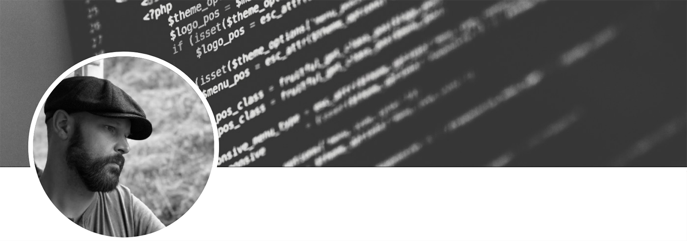
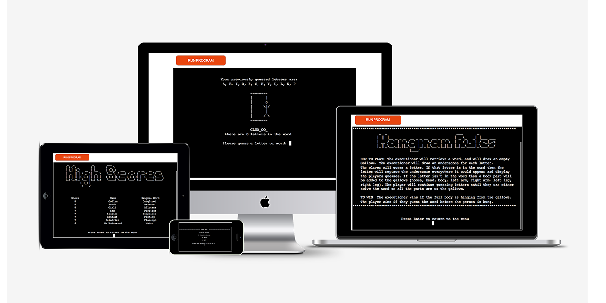
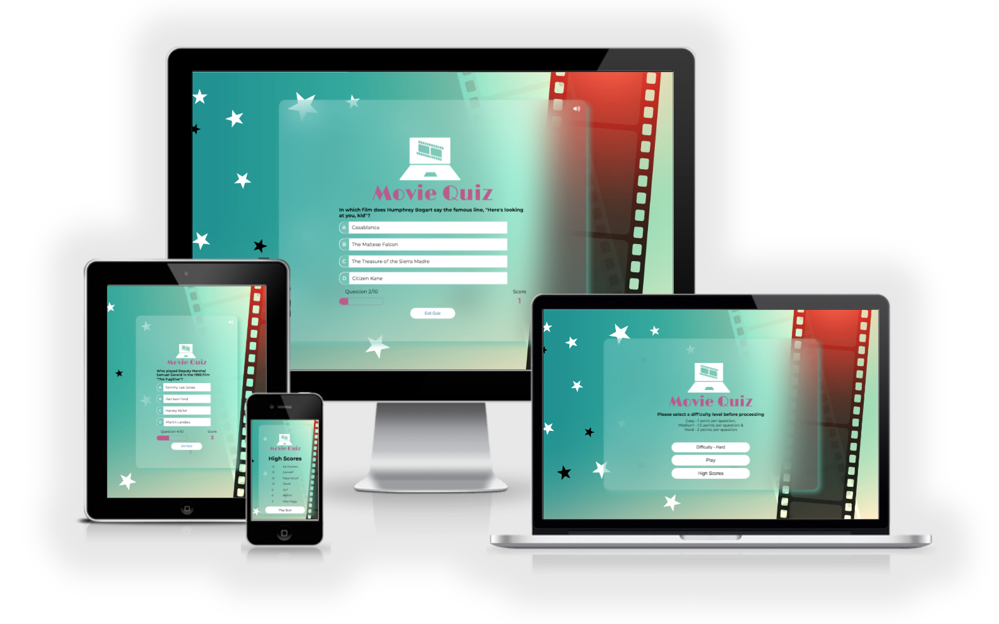
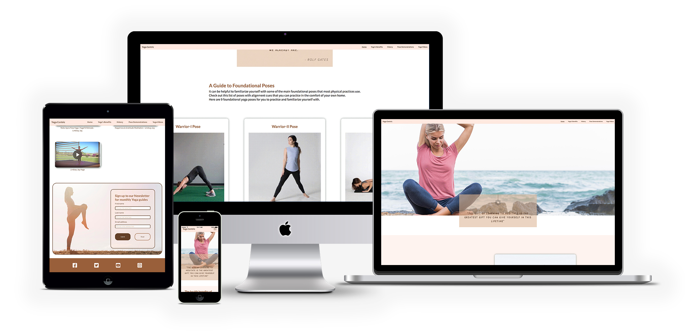

Hi I'm a Junior Full Stack Developer in training with the Code Institute and this is my GitHub repository to show my projects towards my Diploma in Software Development (E-commerce Applications)

# Currently working on:

## _Portfolio Project Five_

E-commerce Applications
Project purpose:
Build a Full-Stack site based on business logic used to control a centrally-owned dataset. Set up an authentication mechanism and provide paid access to the site's data and/or other activities based on the dataset, such as the purchase of a product/service..

-   [Currently working on:](#currently-working-on)
    -   [_Portfolio Project Five_](#portfolio-project-five)
    -   [Leanne's Learners](#leannes-learners)
        -   [Portfolio Project Four](#portfolio-project-four)
    -   [Hangman](#hangman)
        -   [Portfolio Project Three](#portfolio-project-three)
    -   [Movie Quiz](#movie-quiz)
        -   [Portfolio Project Two](#portfolio-project-two)
    -   [Yoga Centric](#yoga-centric)
        -   [Portfolio Project One](#portfolio-project-one)

## Leanne's Learners

### Portfolio Project Four

This is my website for Leanne's Learners.
The goal of this site was to build a Full-Stack site based on business logic used to control a centrally-owned dataset. Setting up an authentication mechanism and providing a role-based access to the site's data or other activities based on the dataset.  
The Site allows Staff members to create, edit and delete blog posts from the Frontend. Also be able to delete any Post's comment.  
Registered site users can add likes to posts, create comments, add likes and dislikes to comments, reply to comments and delete their own comments.
Staff members are able to fill all pages information from within the Administration site.

The site takes advantage of the Django Framework and Bootstrap.

 

 
 

## Hangman

### Portfolio Project Three

This is my Hangman game.
The goal of the game is to demonstrate my knowledge of python whilst providing a fun game, which runs in the Code Institute mock terminal on Heroku with the constraints of a window size of 80 by 24 characters . The Game words are fetched from [Random Word (API)](https://random-word-api.herokuapp.com/home)

 

 
 

## Movie Quiz

### Portfolio Project Two

This is my movie quiz site.
The goal of the site was to demonstrate my knowledge of javascript whilst providing a fun quiz game. These questions are fetched from [Open Trivia (API) Database](https://opentdb.com/api_config.php)
For this project I am delighted to say that I received a Distinction.

 

 
 

## Yoga Centric

### Portfolio Project One

My first web site built from scratch, this was to demonstrate my new found knowledge of HTML and CSS.
For this project I am happy to say I received a Merit.

 

 
 

