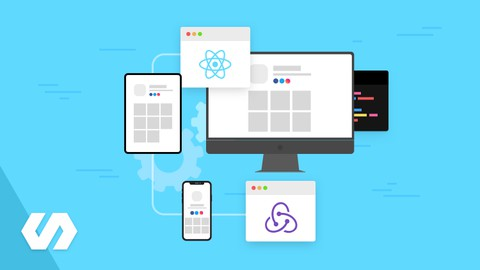
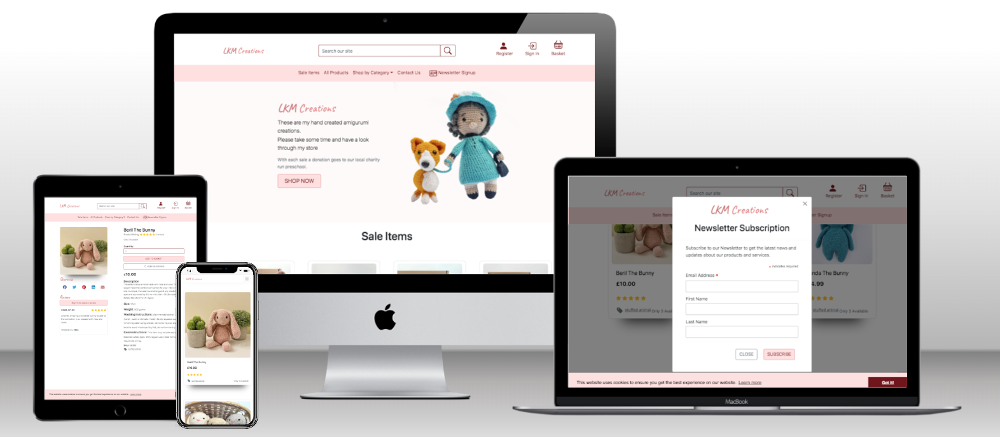
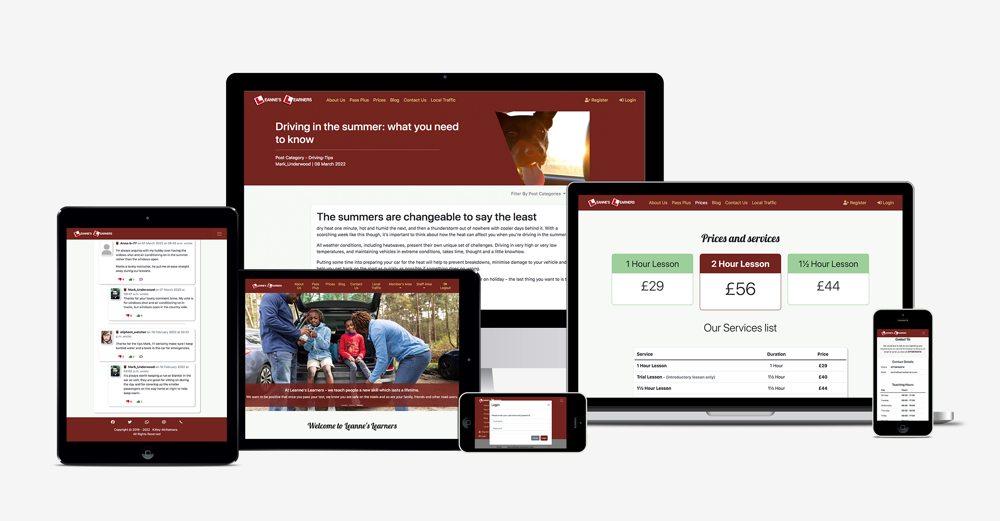

Hi I'm a Junior Full Stack Developer I recently received my Diploma in Full Stack Software Development (E-commerce Applications) [certificate link](https://www.credential.net/6bf711c7-2478-4e81-9841-e0aa52414f54) from the Code Institute, passing with a Merit Grade, and this is my GitHub repository to show my projects created during this period contributing towards my final grade.

# Table of Contents <!-- omit in toc -->
- [Additional Courses taken.](#additional-courses-taken)
  - [Currently taking:](#currently-taking)
    - [Udemy - Modern React with Redux -](#udemy---modern-react-with-redux--)
  - [Recently Completed:](#recently-completed)
    - [Udemy - Advanced CSS and Sass: Flexbox, Grid, Animations and More!](#udemy---advanced-css-and-sass-flexbox-grid-animations-and-more)
- [Project work](#project-work)
  - [LKM Creations](#lkm-creations)
    - [Portfolio Project Five](#portfolio-project-five)
  - [Leanne's Learners](#leannes-learners)
    - [Portfolio Project Four](#portfolio-project-four)
  - [Hangman](#hangman)
    - [Portfolio Project Three](#portfolio-project-three)
  - [Movie Quiz](#movie-quiz)
    - [Portfolio Project Two](#portfolio-project-two)
  - [Yoga Centric](#yoga-centric)
    - [Portfolio Project One](#portfolio-project-one)

***
# Additional Courses taken.
## Currently taking:
### Udemy - Modern React with Redux -
Master React and Redux with React Router, Webpack, and Create-React-App. Includes Hooks!

 

 
 

***
## Recently Completed:
### Udemy - Advanced CSS and Sass: Flexbox, Grid, Animations and More!
The most advanced and modern CSS course on the internet: master flexbox, CSS Grid, responsive design, and so much more.

 

 
 

***

# Project work
## LKM Creations
### Portfolio Project Five

This is my website for LKM Creations.
The goal of this site was to build a Full-Stack E-Commerce site.

Building a Full-Stack site based on business logic used to control a centrally-owned dataset. Set up an authentication mechanism and provide paid access to the site's data and/or other activities based on the dataset, such as the purchase of a product/service.

The site takes advantage of the Django Framework and Bootstrap.

 

 
 

***
## Leanne's Learners
### Portfolio Project Four

This is my website for Leanne's Learners.
The goal of this site was to build a Full-Stack site based on business logic used to control a centrally-owned dataset. Setting up an authentication mechanism and providing a role-based access to the site's data or other activities based on the dataset.
The Site allows Staff members to create, edit and delete blog posts from the Frontend. Also be able to delete any Post's comment.
Registered site users can add likes to posts, create comments, add likes and dislikes to comments, reply to comments and delete their own comments.
Staff members are able to fill all pages information from within the Administration site.

The site takes advantage of the Django Framework and Bootstrap.
For this project I am happy to say I received a Merit.

 

 
 

***
## Hangman
### Portfolio Project Three

This is my Hangman game.
The goal of the game is to demonstrate my knowledge of python whilst providing a fun game, which runs in the Code Institute mock terminal on Heroku with the constraints of a window size of 80 by 24 characters . The Game words are fetched from [Random Word (API)](https://random-word-api.herokuapp.com/home). For this project I am happy to say I received a Merit.

 

 
 

***
## Movie Quiz
### Portfolio Project Two

This is my movie quiz site.
The goal of the site was to demonstrate my knowledge of javascript whilst providing a fun quiz game. These questions are fetched from [Open Trivia (API) Database](https://opentdb.com/api_config.php)
For this project I am delighted to say that I received a Distinction.

 

 
 

***
## Yoga Centric
### Portfolio Project One

My first web site built from scratch, this was to demonstrate my new found knowledge of HTML and CSS.
For this project I am happy to say I received a Merit.

 

 
 

